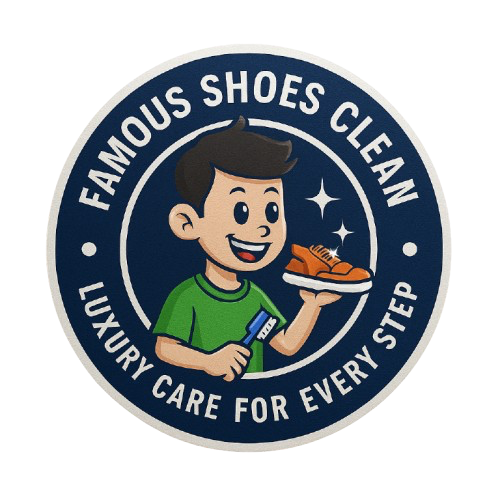

<html lang="id">
<head>
<meta charset="UTF-8">
<meta name="viewport" content="width=device-width, initial-scale=1.0">
<title>Famous Shoes Clean - Cuci Sepatu Profesional</title>
<link href="https://fonts.googleapis.com/css2?family=Roboto:wght@400;700&display=swap" rel="stylesheet">

</head>
<body>

<!-- Header -->
<header>
    
    

        <h1>Bersihkan Sepatu Favoritmu!</h1>
        
Lalu? Tampil lebih percaya diri di setiap langkahmu

        <a href="https://wa.me/6282322746680" class="btn btn-primary">Konsultasi Sekarang</a>
        <a href="#services" class="btn btn-secondary">Lihat Layanan</a>
    

    

        
        
        
        
        
        
        
        
        
        
    

</header>

<!-- Sections -->
<section id="services">
    

        
        
        
    

    <h2>Kenapa Memilih Famous Shoes Clean?</h2>
    

        
<h3>Profesional & Berpengalaman</h3>
Tim ahli yang mampu merawat semua jenis sepatu dengan aman dan tepat.

        
<h3>Aman untuk Semua Bahan</h3>
Sepatu sneakers, kulit, kanvas, hingga suede bisa kami tangani.

        
<h3>Cepat & Tepat Waktu</h3>
Layanan express tersedia agar sepatu kembali bersih sesuai jadwal.

        
<h3>Ramah Lingkungan</h3>
Menggunakan produk pembersih yang eco-friendly dan aman bagi sepatu.

    

</section>

<section id="packages">
    

        
        
        
    

    <h2>Pilih Paket Layanan Sesuai Kebutuhanmu</h2>
    

        
<h3>Fast Clean</h3>
Cuci sepatu bagian upper dan midsole

Rp30.000

Waktu pengerjaan: 3 Hari
<a href="https://wa.me/6282322746680" class="btn">Konsultasi</a>

        
<h3>Deep Clean</h3>
Cuci bagian upper, midsole, insole dan outsole cocok untuk sepatu berwarna tidak untuk sepatu putih

Rp35.000

Waktu pengerjaan: 3-4 Hari
<a href="https://wa.me/6282322746680" class="btn">Konsultasi</a>

        
<h3>Leather Care</h3>
cocok untuk sepatu berbahan kulit asli & kulit sintetis

Rp40.000

Waktu pengerjaan: 2 Hari
<a href="https://wa.me/6282322746680" class="btn">Konsultasi</a>

        
<h3>Suede Care</h3>
cocok untuk sepatu berbahan suede

Rp45.000

Waktu pengerjaan: 3-4 Hari
<a href="https://wa.me/6282322746680" class="btn">Konsultasi</a>

        
<h3>Full White Shoes</h3>
cocok untuk sepatu berwarna putih

Rp40.000

Waktu pengerjaan: 3-4 Hari
<a href="https://wa.me/6282322746680?text=Halo%2C%20saya%20ingin%20konsultasi%20terlebih%20dahulu%20sebelum%20memesan" class="btn" target="_blank">Konsultasi & Pesan</a>

        
<h3>Kids Shoes</h3>
cocok untuk sepatu anak di bawah size 30

Rp15.000

Waktu pengerjaan: 3 Hari
<a href="https://wa.me/6282322746680?text=Halo%2C%20saya%20ingin%20konsultasi%20terlebih%20dahulu%20sebelum%20memesan" class="btn" target="_blank">Konsultasi & Pesan</a>

        
<h3>Women Shoes</h3>
cocok untuk Flat Shoes & High Heels

Rp25.000

Waktu pengerjaan: 3 Hari
<a href="https://wa.me/6282322746680?text=Halo%2C%20saya%20ingin%20konsultasi%20terlebih%20dahulu%20sebelum%20memesan" class="btn" target="_blank">Konsultasi & Pesan</a>

    

</section>

<section id="testimonials">
    

        
        
    

    <h2>Apa Kata Pelanggan Kami?</h2>
    

        

"hasil cucian sangat memuaskan, sepatu jadi bersih tanpa merusak bahan, pelayanan juga ramah dan tepat waktu, dapet bonus parfum jugaa terimakasih. sangatt recommended👍🏻👍🏻"
– Arin Rachma

        

"First time nyuci sepatu disini, bener bener oke banget si kualitasnya, balik kayak jadi baru lgi, maybe bisa si nyuci sepatu atau apapun itu disini. Harganya juga worth it bgt, ownernya juga ramah pol, pokonya oke deh. Kalian yg lgi nyari tmpt nyuci sepatu atau tas atau yg lain boleh kesini sih, dijamin oke bgt 👍🏻🫰🏻🤗"
– Amanda Ayu Saputri

        

"jujurr puas banget cuci sepatu di sini. sepatu yang tadinya kusam jadi bersih lagi, detailnya rapi, dan ngga ngerusak bahan. bonusnya ada free parfum sepatu, jadi wanginya tahan lama plus bisa antar jemput, jadi ngga ribet sama sekali. fix recommended dan bakal langganan!😍🫶"
– isfa fadlila

        

"Finally nemu tempat cucian sepatu yg gak asal2 an nyuci bener2 bersih kinclong dan GAADA bahan YANG RUSAK . Sepatu item ku yg unurnya udh lebih dari 5 tahun jg gaada yg rusak kulit sintetis nya krn saking lamanya terbukti dalemnya pada brawul tp overall GOOD terus dikasi silica gel juga the best pertahankan kualitas ya❤️"
– Erlinaw

        

"pelayanannya oke bgtt dan hasil cuci sepatunya bersih dan wangi, dapet bonus parfum sepatu juga harga dan kualitas sebanding. highly recommended!🤩🤩"
– Angesti shellya

        

"aku selalu cuci sepatu di sini, selain deket di sini jg murah dan bersihh, pelayanannya juga oke, bisa diantar jemput jg sepatunya🤩🤩"
–Tiara Kusuma

        

"bagus banget hasilnya, harga juga ter worth it, bisa pick up & delivery"
–Nabilla Andini

        

"Bagus ada pelayanan antar jemput👍🏻👍🏻👍🏻👍🏻👍🏻"
–Anna Suryani

        

"Bakal langganan disini pelayanan oke banget"
–Yuniar iriana

    

</section>

<!-- Cara pesan -->
<section id="how-to-order">
  </section>
  
 <!-- Cara pesan -->
<section id="how-to-order">
  </section>
  
<section id="how-to-order">
    

        
        
        
    

    <h2>Mudah & Cepat</h2>
    

        
<h3>1. Pilih Paket</h3>
Pilih paket sesuai kebutuhanmu.

        
<h3>2. Konsultasi & Kirim Sepatu</h3>
Hubungi kami melalui WhatsApp/Instagram/TikTok untuk konsultasi sebelum mengirim sepatu.

        
<h3>3. Terima Sepatu Bersih</h3>
Sepatu dikembalikan bersih dan wangi sesuai jadwal.

    

    

        <a href="https://wa.me/6282322746680" class="btn btn-primary">Konsultasi Sekarang</a>
    

</section>

<!-- Footer -->
<!-- Google Maps -->
<section id="location">
    <h2>Lokasi Kami</h2>
    
    

    <iframe 
    src="https://www.google.com/maps/embed?pb=!1m18!1m12!1m3!1d3959.4672592317875!2d110.36564290000001!3d-7.0716980000000005!2m3!1f0!2f0!3f0!3m2!1i1024!2i768!4f13.1!3m3!1m2!1s0x2e7089002bbc34f5%3A0xca141c03afad5ee3!2sfamous%20shoes%20clean!5e0!3m2!1sid!2sid!4v1773155029051!5m2!1sid!2sid" width="100%" height="100%" style="border:0;" allowfullscreen="" loading="lazy" referrerpolicy="no-referrer-when-downgrade"></iframe>"
    </iframe>
    

    
    </section>

<footer>
    
    
Hubungi Kami: 
        <a href="https://wa.me/6282322746680">WhatsApp</a> | 
        <a href="https://www.instagram.com/famous_shoesclean">Instagram</a> | 
        <a href="https://www.tiktok.com/@famous_shoesclean">TikTok</a>
    

    
Alamat: Perumnas Kalaan RT 05 RW 04 , Kec. Gn. Pati, Jawa Tengah, Semarang, Indonesia

    
&copy; 2026 FamousShoesClean. Semua hak cipta dilindungi.

</footer>

</body>
</html>

